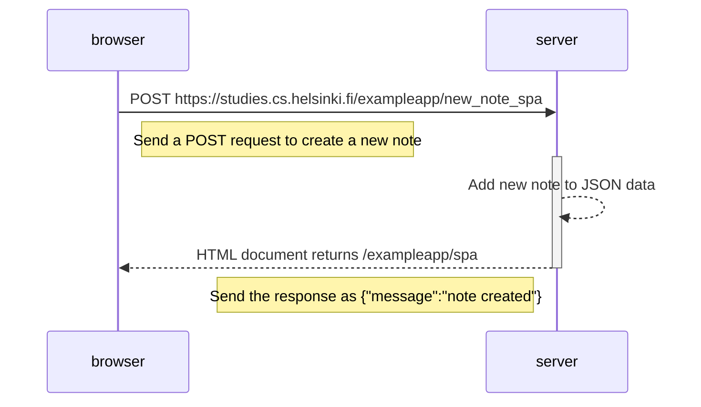

```mermaid
sequenceDiagram
    participant browser
    participant server

    browser->>server: POST https://studies.cs.helsinki.fi/exampleapp/new_note_spa

    Note right of browser: Send a POST request to create a new note
    
    activate server
    server-->>server: Add new note to JSON data
    server-->>browser: HTML document returns /exampleapp/spa 
    deactivate server

    Note left of server: Send the response as {"message":"note created"}

```